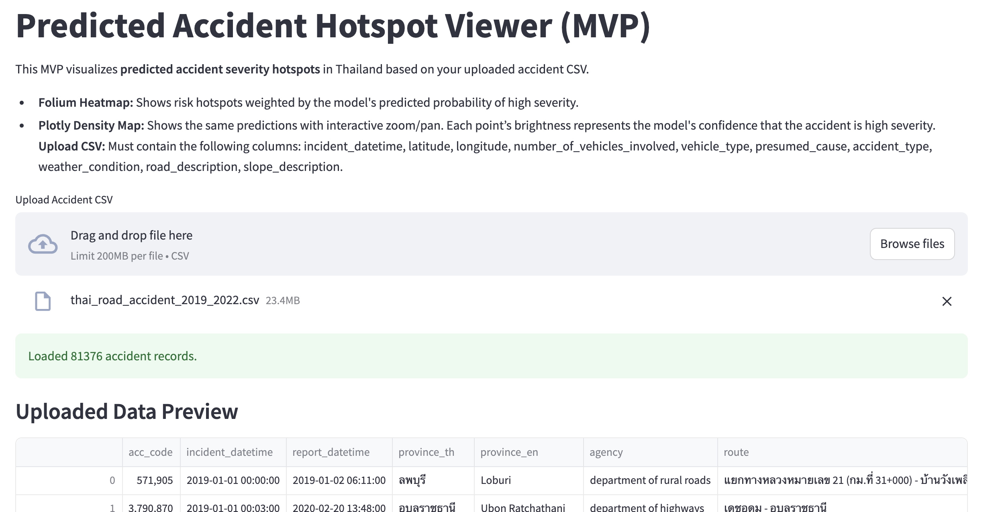
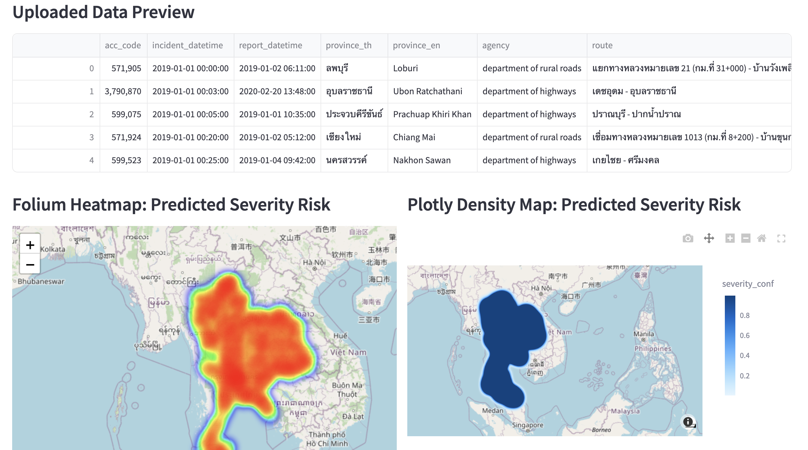

# Car Accident Prediction - Thailand Road Safety Analysis

A machine learning project for predicting accident severity hotspots in [Thailand using historical road accident data (2019-2022)](https://www.kaggle.com/datasets/thaweewatboy/thailand-road-accident-2019-2022). The project includes interactive visualizations through a Streamlit web application.

## Project Overview

This [project](Gana_finalreport.pdf) analyzes Thai road accident data to:
- Predict accident severity (high/low) using machine learning models
- Visualize accident hotspots on interactive maps
- Identify patterns in accident occurrence based on temporal, spatial, and contextual features

### Visual Overview
<div align="center">
  
  
</div>

## Features

- **Interactive Web Application**: Streamlit-based dashboard for visualizing predicted accident hotspots
- **Multiple ML Models**: XGBoost and LightGBM models for severity prediction
- **Geospatial Analysis**: Heat maps and density maps showing risk zones
- **Comprehensive EDA**: Exploratory data analysis of accident patterns
- **Model Optimization**: Grid search and cross-validation for hyperparameter tuning

## Project Structure

```
Car-Accident-Prediction/
├── app.py                              # Streamlit web application
├── requirements.txt                    # Python dependencies
├── models/
│   ├── BEST_XGBOOST_MODEL.pkl         # Best XGBoost model
│   ├── BEST_LIGHTGBM_MODEL.pkl        # Best LightGBM model
│   ├── model_xgb.joblib               # Alternative XGBoost model
│   ├── final_preprocessor.joblib      # Data preprocessor
│   ├── final_preprocessor_improved.joblib
│   ├── preprocessor.joblib
│   ├── baseline_cv_results.joblib     # Cross-validation results
│   └── metadata_optionA.json          # Model metadata
├── notebooks/
│   ├── Testing_and_eda.ipynb          # Exploratory Data Analysis
│   ├── final_training.ipynb           # Final model training
│   └── random_grid_search.ipynb       # Hyperparameter tuning
├── data/
│   ├── thai_road_accident_2019_2022.csv      # Raw accident data
│   ├── thai_road_accident_2019_2022.parquet  # Optimized format
│   └── sample_accidents.csv           # Sample data for testing
└── new_car.pem                        # Private key file (⚠️ WARNING: Should not be in repository)
```

## Quick Start

### Prerequisites

- Python 3.8 or higher
- pip package manager

### Installation

1. Clone the repository:
```bash
git clone https://github.com/NarimT/Car-Accident-Prediction.git
cd Car-Accident-Prediction
```

2. Install dependencies:
```bash
pip install -r requirements.txt
```

### Running the Application

Launch the Streamlit web application:
```bash
streamlit run app.py
```

The application will open in your browser at `http://localhost:8501`

## Usage

### Web Application

1. Upload a CSV file containing accident data with the following required columns:
   - `incident_datetime`: Date and time of the accident
   - `latitude`: Latitude coordinate
   - `longitude`: Longitude coordinate
   - `number_of_vehicles_involved`: Number of vehicles
   - `vehicle_type`: Type of vehicle
   - `presumed_cause`: Cause of accident
   - `accident_type`: Type of accident
   - `weather_condition`: Weather conditions
   - `road_description`: Road characteristics
   - `slope_description`: Road slope
   - `province_en`: Province name (English)
   - `number_of_fatalities`: Number of fatalities in the accident

2. View predictions and visualizations:
   - **Folium Heatmap**: Shows risk hotspots weighted by predicted severity
   - **Plotly Density Map**: Interactive map with zoom/pan capabilities
   - **Prediction Results**: Detailed predictions with confidence scores

### Notebooks

Explore the analysis and model development process:

1. **Testing_and_eda.ipynb**: Initial exploratory data analysis
2. **final_training.ipynb**: Model training with cross-validation
3. **random_grid_search.ipynb**: Hyperparameter optimization

## Models

### XGBoost Model
- Primary model used in production (app.py)
- Optimized through grid search
- Handles categorical and numerical features

### LightGBM Model
- Alternative gradient boosting model
- Faster training on large datasets
- Comparable performance to XGBoost

### Features Used
- **Temporal**: hour, weekday, month
- **Spatial**: latitude, longitude, grid_count
- **Contextual**: vehicle type, weather, road conditions, accident type
- **Numerical**: number of vehicles involved

## Dataset

The project uses Thai road accident data from 2019-2022, containing:
- Accident locations (GPS coordinates)
- Temporal information (date, time)
- Accident characteristics (type, severity, cause)
- Environmental factors (weather, road conditions)
- Vehicle information

## Dependencies

Key packages (see `requirements.txt` for full list):
- **Machine Learning**: scikit-learn, xgboost, lightgbm, imbalanced-learn
- **Data Processing**: pandas, numpy
- **Visualization**: matplotlib, seaborn, plotly, folium
- **Web App**: streamlit, streamlit-folium
- **Utilities**: joblib

## Model Performance

Models are evaluated using:
- Cross-validation accuracy
- Confusion matrix analysis
- Precision, recall, and F1-score
- Grid search for optimal hyperparameters


## Contributing

Contributions are welcome! Please feel free to submit a Pull Request.

## License

This project is part of the Computer Programming for Data Science course at AIT (Asian Institute of Technology)

## Authors

- NarimT

## Acknowledgments

- Thai road accident data providers
- Open-source ML and visualization libraries
